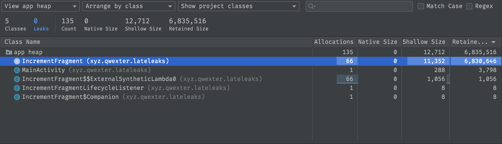
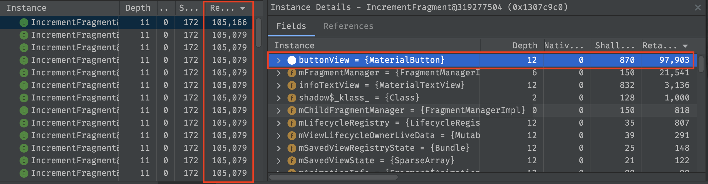
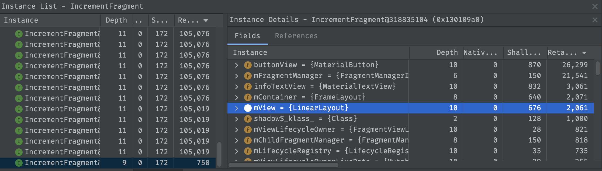

Hi! In the last few weeks, I went through several technical interviews for an Android developer position, and one of the recurring questions was, "What are memory leaks? How can we create them? How can we find them?". I found that some developers don't know about the other side of `lateinit var` usage with Fragments and how easily it can cause leaks.

> In short: the lifecycle of fragments and views is different. When our fragments go to the back stack, the view should release memory, but if we use fragment-level fields with `lateinit var`, we keep a reference, and GC can't clear outdated objects.
> 

This issue occurs with old-school `findViewById` and `ViewBinding` cases. For example, let's create a simple fragment:

``` kotlin
class IncrementFragment : Fragment(R.layout.fragment_increment) {

    private lateinit var infoTextView: TextView
    private lateinit var buttonView: Button

    override fun onViewCreated(view: View, savedInstanceState: Bundle?) {
        super.onViewCreated(view, savedInstanceState)
        val layerNumber = arguments?.getInt(NUMBER_KEY) ?: 0
        infoTextView = view.findViewById(R.id.info_text_view)
        buttonView = view.findViewById(R.id.add_fragment_button)
				bindViews(layerNumber)
    }

		// here we bind data and setup views and click listeners
    private fun bindViews(layerNumber: Int) {
				infoTextView.text = "Current fragment is $layerNumber"
        val newLayerNumber = layerNumber + 1
        buttonView.text = "Add new layer ($newLayerNumber?)"
        buttonView.setOnClickListener {
            navigate(newLayerNumber)
        }
    }

    // here we just replace one fragment to new with parentFragmentManager
    private fun navigate(newLayerNumber: Int) {
        parentFragmentManager.beginTransaction()
            .replace(
                R.id.main_container,
                IncrementFragment::class.java,
                createArgs(newLayerNumber),
                "ADD_NUMBER_$newLayerNumber"
            )
            .addToBackStack("ADD_NUMBER_$newLayerNumber")
            .commit()
    }

}

```

If we run this example and add some fragments to the back stack (yes, I added a lot of fragments to the stack), then capture a heap dump, we can see something like this:



Here we can find records about our fragments in the stack, and if we look deeper, we can see that most back stacked instances have a similar size and contain active links to fragment-level view fields referencing old views:



If we look at the visible fragment, we can see an actual reference to `mView`:



If we go back through the fragment stack, we recreate a new instance of the view, find new views, and store references to fragment-level fields. It seems like, right now, GC can release old memories, right? In my example, yes. But sometimes we can't release memories from views because we have callbacks (like `OnClickListener`, `LiftOnScrollListener`). We probably can find some troubles and should pay attention. Kotlin has some strategies on how to build classes and lambdas better to prevent memory leaks. You can start with [Yangwei](https://medium.com/@yangweigbh)'s notes about lambdas and don't forget to occasionally check the decompiled code (`Tools→Kotlin→Show Kotlin Bytecode` and look there or press `Decompile`).

A few final points:

- If we look at some of the screenshots above, we can see that they indicate "0 Leaks". However, this is not true. If we run [LeakCanary](https://github.com/square/leakcanary), we get notifications about memory leaks. I think using both methods is better.
- Don't use `lateinit var` with fragment UI - if you can't nullify references to fragment-level fields, you get a memory leak (Google mentioned [this](https://developer.android.com/topic/libraries/view-binding#fragments)). If you use viewBinding, check some [delegates](https://proandroiddev.com/make-android-view-binding-great-with-kotlin-b71dd9c87719) or write your own (you can work with plain views in a similar way).
- Sometimes I hear statements like, "if we use `lateinit var`, we can avoid many null-checks and save time and
